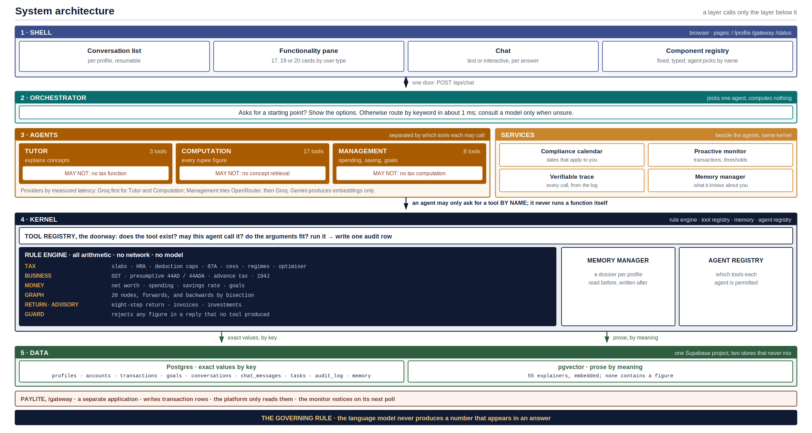
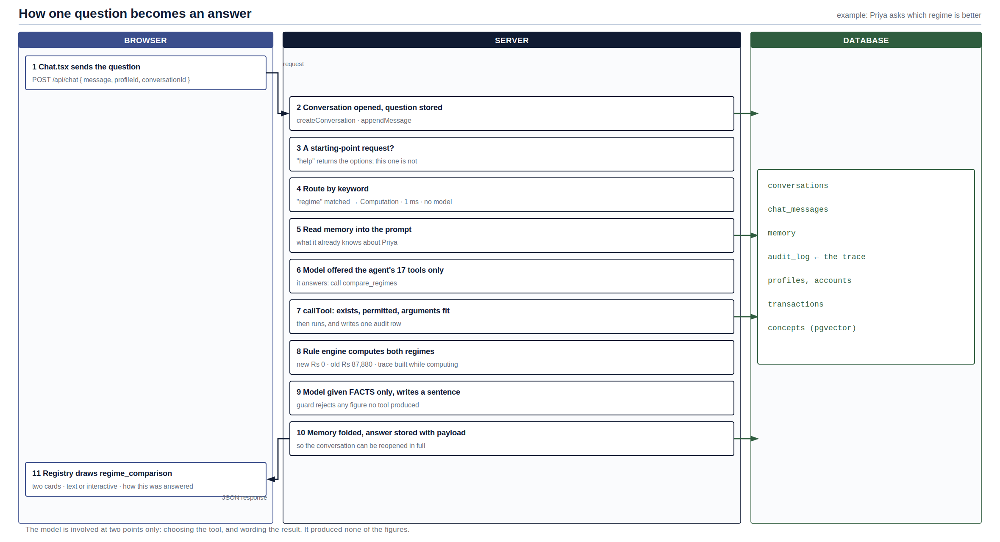

# Master Plan

## A Conversational Platform for Financial Literacy and Management using a Multi-Agent LLM Orchestrator

| | |
|---|---|
| Course | BCSE497J Project-I, School of Computer Science and Engineering, Vellore Institute of Technology |
| Team | M Naga Sai Dattu (23BCE0757), Tanishq Daga (23BCE2119), Devesh Atul Mahajan (23BCE0801) |
| Guide | Dr. Kalaavathi B |
| Repository | https://github.com/Nagasai-Datta/taxwise |
| Document date | 22 September 2026 |
| Describes | The repository at its latest commit, with the audit fixes in section 16.1 applied |

---

## 1. How to read this document

This is the single complete description of the project as it stands. It is written so that someone who has never seen the project, human or language model, can understand all of it without asking anyone.

**It describes the current state only.** It does not narrate how the project changed over time. Where a design decision was made because of something that was measured, the measurement is given as evidence in section 15, not as history.

**Precedence.** If this document disagrees with anything else, use this order:

1. This document
2. The code in the repository
3. Anything remembered from earlier conversations

Earlier conversations contain descriptions of the project that are no longer true, including a different title, a different database, a different interface layout, and different model assignments. Treat any such conflict as stale.

**Naming.** In academic writing, the system is referred to by its full title, *A Conversational Platform for Financial Literacy and Management using a Multi-Agent LLM Orchestrator*, or as "the platform". The word `taxwise` appears only as the repository and folder name.

**Where to start.**

| If you want to | Read |
|---|---|
| Understand the idea in five minutes | Section 2 |
| Understand the problem and why it matters | Sections 3 and 4 |
| Understand how it is built | Sections 5, 6 and 7 |
| Understand how a question becomes an answer | Section 8 |
| Run it yourself | Section 14 |
| Write a paper about it | Sections 15, 16, 17 and 18 |
| Look up a term | Section 19 |

---

## 2. Summary

Financial literacy in India is low, and tax knowledge is its weakest part. A young person starting work faces tax decisions with no preparation. The tools available to them fail in two different ways. Tax portals calculate correctly but assume the user already knows the vocabulary. General-purpose AI chatbots explain well, but published studies show they make material errors when calculating jurisdiction-specific tax.

This platform is a third option: one chat interface where a young earner can learn a concept, compute a figure correctly, and understand what it means for their money.

**The central design rule is that the language model never produces a number that appears in an answer.** The model decides which calculation is needed and puts the result into words. A deterministic rule engine, reading a versioned rulebook, produces every figure. This rule is enforced in five separate places rather than stated once.

Three agents sit behind the chat. The **Tutor** explains concepts. The **Computation** agent calculates tax, GST and related figures. The **Management** agent reports on spending, saving and goals. What separates them is not their instructions but the list of tools each is permitted to call: the Tutor cannot reach a tax function at all.

The system is organised as five layers, like an operating system, in which a kernel layer owns the arithmetic, the tools, the memory and the agent permissions. A layer may only call the layer below it.

Three properties follow from the central rule without any extra machinery:

- **Traceable.** Every figure can be traced to the rule that produced it.
- **Reproducible.** The same question gives the same figures, whichever model is used.
- **Safe when the model fails.** With no model available at all, every figure is still correct; only the wording becomes plainer.

The platform is validated in a laboratory setting on three representative earner profiles: a salaried employee, a business owner, and a freelance professional. It targets Technology Readiness Level 4. It does not connect to any bank or government system.

---

## 3. The problem

### 3.1 Financial literacy in India

The National Centre for Financial Education's 2019 survey (NCFE-FLIS 2019) reported that 27 percent of Indian adults were financially literate, with the weakest results in tax and procedural knowledge. This figure is used in the project's literature review and must be checked against the original report before it is cited in a paper (see section 18).

Income tax is not taught at school or university, yet every salaried employee, business owner and self-employed professional is expected to understand it from their first month of earning. A payslip introduces terms such as gross salary, tax deducted at source (TDS), house rent allowance (HRA) and Chapter VI-A deductions without explanation.

### 3.2 Why existing tools do not solve it

**Tax portals and calculators** are transactional. They accept figures and return figures. They assume the user already understands what to enter and what the result means.

**General-purpose AI assistants** explain fluently but are unreliable at jurisdiction-specific computation. Two strands of published work document this: studies of large language models on tax law tasks, and evaluations on the VITA test used for low-income taxpayer assistance. Both report material errors in computation and citation (references [15] and [24] in section 18).

A language model is a text predictor. It does not calculate; it produces text that resembles a calculation. That is acceptable for explanation and unacceptable for a tax figure.

### 3.3 Who this is for

Young Indian earners in their first years of work, in three situations that the tax code treats differently:

- **Salaried employees**, who receive a Form 16, face a choice between two tax regimes, and may claim a house rent allowance exemption.
- **Business owners**, who deal with GST registration, input tax credit, advance tax, and the option of presumptive taxation under section 44AD.
- **Freelance professionals**, who have tax deducted by clients under section 194J, may be near the GST registration threshold, and may use presumptive taxation under section 44ADA.

---

## 4. Research gaps and objectives

### 4.1 The five gaps

1. **Fragmented tools.** Literacy, tax computation and money management are served by separate products. None guides a young earner from concept to computation to consequence within one conversation.
2. **Single-mode interaction.** Tools are either form-driven or plain-text chatbots. None lets the user choose, for each answer, between reading text and using a generated interactive component.
3. **Unreliable, untraceable figures.** AI assistants let the model produce numbers directly, which admits error and leaves no path from a displayed figure back to the rule that produced it.
4. **No agent orchestration for personal finance.** Existing assistants are single models. None coordinates specialised agents for teaching, computation and management.
5. **No layered architecture.** Current systems lack a structure in which a dedicated kernel owns the agents, tools and memory, which limits control and safety.

### 4.2 The five objectives, and what satisfies each

| # | Objective | Satisfied by |
|---|---|---|
| 1 | Build a single conversational platform unifying literacy, computation and money management | Three agents behind one chat; the functionality pane; the profile page |
| 2 | Answer every task as text or as a generated interactive interface, at the user's choice | The dual-mode toggle on every result, drawn from one fixed component registry |
| 3 | Perform all arithmetic through deterministic tools, never the language model | The rule engine, the tool registry, and the five enforcement points in section 5 |
| 4 | Coordinate specialised agents through a multi-agent orchestrator | The orchestrator routing to Tutor, Computation and Management, each with its own permitted tools |
| 5 | Structure the system as a layered architecture with a kernel managing agents, tools and memory | Five layers; the kernel holds the rule engine, tool registry, memory manager and agent registry |

### 4.3 Sustainable Development Goals and readiness

- **SDG 4, Quality Education:** building financial and tax literacy through conversational teaching.
- **SDG 8, Decent Work and Economic Growth:** financial capability and sound money management for people entering work.
- **Technology Readiness Level 4:** validated in a laboratory environment on representative data. Real bank and government integration, and deployment at scale, would be TRL 5 and above and are outside scope.

---

## 5. The governing rule, and the five places it is enforced

> **The language model never produces a number that appears in an answer.**

The model is allowed to do three things: understand the question, decide which calculation to run, and put the result into words. It may repeat a figure that a tool produced. It may never originate one.

A rule stated once can be ignored. This one is enforced at five separate points, each catching something the others cannot.

| # | Where | What it prevents |
|---|---|---|
| 1 | **Tool argument schemas** | A model supplying a made-up income. No tool accepts the user's income, balance, turnover or receipts from the model; every such figure is loaded from the user's profile inside the tool. The most a model may supply is a choice: which regime, which section, a hypothetical amount to invest, or a target figure the user named. Figures from a Form 16 or an invoice are typed by the person into a form: the model is shown those two tools with no arguments at all, so it can only ask for the form, and anything it sends there anyway is dropped. |
| 2 | **Permission check** | An agent using a capability it should not have. Every tool call passes through one function that refuses any tool not on that agent's list, whatever name the model invents. |
| 3 | **Facts-only return** | The model quoting something it was not given. After a tool runs, the model receives a short flat list of named values ("facts"), never the full result. |
| 4 | **The guard** | The model writing a figure into its own prose. The finished reply is scanned for numbers; any number not found in the facts causes the reply to be discarded and rewritten from the facts alone. It also catches a model's own arithmetic on real inputs, and numbers written out in words. |
| 5 | **Authoritative results** | The model inverting a verdict while quoting only real figures. Some results carry a verdict that a paraphrase could reverse, such as "this target cannot be reached". For these, the wording is produced from the figures, not by the model. |

**Before the guard checks a reply, the reply is normalised.** A model may write "2.4 million" where a tool returned 2400000, or use Western digit grouping (2,400,000) where Indian grouping (24,00,000) is expected. Scale words and grouping are resolved to the exact figure first, so that a reply which is only differently phrased is not rejected, while a genuinely invented figure still is.

---

## 6. Architecture



The system has five layers, modelled on an operating system. The analogy carries one rule that everything else depends on: **a layer may call the layer below it and never the layer above.** The kernel does not know that agents exist, which is what allows all the arithmetic to be tested with no model, no network and no interface present.

### 6.1 Layer 1, Shell (runs in the browser)

The only part the user touches. The main screen has three panes:

- **Conversation list (left).** Every chat is saved per profile and can be reopened exactly as it was, including its interactive cards. A New chat button starts another. Switching profile replaces the whole list.
- **Functionality pane (middle).** Cards describing what this particular user can do: 17 for the salaried profile, 19 for the business owner, 20 for the freelance professional, with 15 shared by all three. Clicking a card shows a plain description and a Compute button. **Compute does not compute anything**: it types a question into the chat, so every request still passes through the same path. Cards already used are ticked from memory.
- **Chat (right).** Where every answer appears. Each answer carries a text or interactive toggle, a one-line plain explanation of how it was reached, an "explain this" control, three labelled follow-up questions, and a single "how this was answered" panel showing routing, steps, tool calls, the guard's verdict and the rule-by-rule working.

**Component registry.** When an answer is interactive, the server sends back the *name* of a component, and the browser looks that name up in a fixed list. The model never writes interface code, because free-form generation would render differently each time and could not be tested.

Three further pages: `/profile` (money, accounts, goals, deadlines, the always-on services, and memory), `/gateway` (the separate payments application), and `/status` (a build dashboard).

### 6.2 Layer 2, Orchestrator

One job: decide which agent owns the question and hand it over. It holds no tools, keeps no memory, and writes nothing the user reads.

It first checks whether the message is a question at all. "Help", "I don't know where to start" and "what can I ask" are requests for a starting point, not questions about a topic, so they skip routing and return a set of openers chosen for that person's occupation.

Otherwise it routes **by keyword first**. A message containing an unambiguous domain word, such as "regime" or "spend", is routed in about one millisecond with no model involved. A model is consulted only when the keywords are unsure. Section 15 gives the measurement that led to this order.

Routing considers the *shape* of a question as well as its subject. A question that works backwards from a wanted figure ("what spending would give me a 50 percent savings rate") goes to Computation even though it is about spending, because working backwards is a Computation capability.

### 6.3 Layer 3, Agents

| Agent | Tools | Handles | Cannot reach |
|---|---|---|---|
| **Tutor** | 3 | What something means, why a rule exists | Any tax function or figure |
| **Computation** | 17 | Anything whose answer is a figure | Concept retrieval |
| **Management** | 8 | Spending, saving, net worth, goals | Tax computation |

Each agent runs the same cycle: read what is already known about the person, choose tools, call them through the kernel, receive facts, and write a reply that the guard then checks. If the model is unavailable or fails, tools are chosen by keyword and the reply is written from the facts by fixed templates. Every figure is identical either way.

**Providers were assigned by measurement** (section 15). Groq is tried first for the orchestrator, Tutor and Computation. Management tries OpenRouter first and then Groq. Gemini is used only to produce the embeddings for concept retrieval, where its slower response does not affect anyone waiting. Every assignment can be overridden in configuration, and every model call has a 12-second limit after which the deterministic path answers instead.

### 6.4 Services, beside the agents

Four services run alongside the agents and use the same kernel.

- **Compliance calendar.** The statutory deadlines that apply to this person, escalating from information to attention to urgent as each approaches. A salaried user is never shown advance tax dates.
- **Proactive monitor.** Watches for new transactions since the last check, a payment far outside the usual size, turnover approaching the GST registration threshold, unused 80C headroom near the end of the financial year, and spending running ahead of receipts.
- **Verifiable trace.** Reports what has been computed, how often and how long it took, read from the audit log.
- **Memory manager.** Holds a dossier per profile: preferences, decisions, open questions, and which concepts have already been explained.

The first three **report; they never act and never compute an answer**. Each observation can carry a question, and pressing it hands that question to the chat. They poll from the browser every 30 minutes by default, adjustable in configuration, with a "check now" button. There is no server-side timer, because a background job that outlives a request would be the only part of the system that could not be reproduced by re-running a command.

### 6.5 Layer 4, Kernel

**Tool registry, the doorway.** Every call from an agent into the arithmetic passes through one function, which checks that the tool exists, checks that this agent may call it, checks that the arguments match the declared shape, runs it, and writes one row to the audit log. That last step is why the verifiable trace needed no separate engineering: a figure cannot reach a user without an audit row appearing first, because there is no other route.

**Rule engine.** All arithmetic. No network, no model, no interface code.

| Family | What it computes |
|---|---|
| Tax | Slab tax band by band, HRA exemption as the least of three amounts, deduction ceilings, the section 87A rebate, cess, both regimes, and the rupee saving from filling unused deductions |
| Business | GST with input tax credit and zero-rated exports, presumptive taxation under 44AD and 44ADA against regular books, the advance tax schedule, TDS under 194J |
| Money | Net worth, spending by category, savings rate, progress towards goals |
| Causal graph | Twenty linked figures, computed forwards, and solved backwards by bisection |
| Return preparation | An eight-step preparation of an income tax return from Form 16 figures |
| Advisory | Invoices, and a comparison of tax-saving investment options |
| Guard | Checking replies, as described in section 5 |

Every calculation **emits its working as it computes**, so the rule-by-rule trace shown to the user is a by-product of the arithmetic, not a reconstruction made afterwards.

**Memory manager** and **agent registry** complete the kernel, as described above.

### 6.6 Layer 5, Data

One Supabase project holding two stores that never mix.

- **Postgres tables**, for exact values looked up by key: profiles, accounts, transactions, goals, conversations, chat messages, tasks, the audit log, and memory.
- **A pgvector table**, for the 55 explanatory texts, found by meaning.

The separation is a correctness requirement, not tidiness. A search by meaning is approximate by design: asked for a tax ceiling, it returns a paragraph *about* that ceiling, and something would then have to read a number out of the paragraph. That something would be the model, which the governing rule forbids.

Every read falls back to seed files when the database is unavailable. A paused or unreachable database therefore cannot stop the platform; it loses history and transactions but every tax figure still computes.

### 6.7 Outside the layers: the payments application

A separate application at `/gateway`, called PayLite, with its own look and vocabulary and no access to the agents, the kernel or the rulebook. It can add funds to any of the demonstration accounts or move money between any two. It writes transaction rows and updates balances. **The platform only reads that table.**

This separation is deliberate. An application that can see an account without being able to move money in it has the same shape as India's Account Aggregator framework, and it makes the proactive monitor demonstrable: money moves in one window, and the monitor reports it in the other on its next check, without the platform having been told.

A transfer always writes both sides, the money leaving one account and arriving in another, inside a single database transaction. Either both rows are written or neither is.

---

## 7. Agents, tools and capabilities

### 7.1 Every tool, and who may call it

A tool is a typed function the model can ask for by name. The model sees the tool's name, a plain description, and the shape of its arguments. It never sees the implementation.

| Tool | Agent | What it returns | Arguments the model may give |
|---|---|---|---|
| `search_concepts` | Tutor | Explanatory prose from the corpus, never a figure | the question |
| `list_deduction_sections` | Tutor | Section names and descriptions, never amounts | none |
| `list_capabilities` | all three | What this user can ask about, grouped | whether to show openers |
| `get_profile_summary` | Computation, Management | The user's own details | none |
| `get_deadlines` | Computation, Management | Statutory dates that apply to this user | GST registration status |
| `compute_tax` | Computation | Full liability under one regime, with the working | which regime |
| `compare_regimes` | Computation | Both regimes and the cheaper one | none |
| `compute_hra_exemption` | Computation | The three HRA candidates and which was lowest | none |
| `optimize_deductions` | Computation | Unused headroom ranked by rupee saving | none |
| `what_if_deduction` | Computation | Tax before and after a hypothetical investment | section, amount |
| `compute_gst` | Computation | GST charged, input credit, net payable, registration status | none |
| `presumptive_vs_books` | Computation | 44AD or 44ADA against regular books, with conditions | none |
| `compute_advance_tax` | Computation | Whether due, and the instalment schedule | whether presumptive |
| `compute_194j_tds` | Computation | TDS clients should have deducted against what was deducted | none |
| `prepare_itr` | Computation | A prepared return in eight steps; asks for Form 16 figures first | none (figures come from the form) |
| `explore_graph` | Computation | The twenty-figure causal graph, with sliders | which regime |
| `solve_backwards` | Computation | The input value that reaches a figure the user wants | target, target value, lever, regime |
| `compare_investments` | Computation | Tax-saving options compared on lock-in and certainty | amount, section |
| `generate_invoice` | Computation | An invoice with GST, expected TDS and the amount that will arrive; asks for details first | none (details come from the form) |
| `compute_net_worth` | Management | Balances across accounts | none |
| `categorize_spending` | Management | Outgoing transactions grouped by category | none |
| `compute_savings_rate` | Management | Share of net income kept | none |
| `compute_goal_progress` | Management | Progress and months to target per goal | none |
| `list_recent_transactions` | Management | Most recent transactions | how many |

Twenty-four tools in total. The Tutor has 3, Computation 17, Management 8. Three are shared: `list_capabilities` by all three agents, and `get_profile_summary` and `get_deadlines` by Computation and Management.

### 7.2 Tools that ask before they answer

Two tools cannot answer without information the system does not hold: preparing a return needs the figures on the person's Form 16, and raising an invoice needs the fee and the client. Guessing would be worse than asking, so these tools can return a **request for input** instead of a result. The chat draws a form inside the conversation, and when the person submits it, the same tool is called again with those values, through the same permission check and with the same audit row.

### 7.3 Capabilities, as the user sees them

The functionality pane lists capabilities by user type. Each names a real tool, and a test enforces that the list cannot promise something the system does not do.

| Group | Capability | Salaried | Business | Professional |
|---|---|:---:|:---:|:---:|
| Learn | Understand a term; see what deductions exist | yes | yes | yes |
| Tax | Compare regimes; compute tax; find unused deductions; try an investment; explore what moves what; work backwards from a target; see deadlines | yes | yes | yes |
| Tax | Work out HRA relief; prepare a return | yes | | |
| Business | Estimate GST; presumptive scheme or books; plan advance tax; raise an invoice | | yes | yes |
| Business | Check what clients deducted under 194J | | | yes |
| Money | Compare where to invest; net worth; spending; savings rate; goals; recent transactions | yes | yes | yes |
| **Total** | | **17** | **19** | **20** |

---

## 8. How data flows



### 8.1 One question, step by step

**Example: Priya asks "which regime is better for me?"**

1. **The browser sends it.** The chat screen posts the message, the profile and the current conversation to `/api/chat`. A card in the functionality pane arrives by exactly the same route, since Compute only types a question.
2. **The conversation is opened and the question stored.** If this is the first message, a conversation is created and titled from it. The question is saved before anything is computed.
3. **Is it a question at all?** "Help" or "I don't know where to start" would skip routing and return openers. This one is a real question.
4. **Routing.** The word "regime" is unambiguous, so it goes to the Computation agent in about one millisecond with no model involved.
5. **Memory is read.** What is already known about Priya (preferences, decisions, concepts already explained) is condensed to a few lines for the agent's instructions.
6. **The model is given only this agent's tools.** Computation's 17 tools are offered; the Tutor's are not. The model replies with a request: call `compare_regimes`.
7. **The doorway.** The request passes through one function that checks the tool exists, that this agent may call it, and that the arguments fit. It then runs the tool and writes one row to the audit log.
8. **The arithmetic.** The rule engine computes Priya's tax under both regimes: standard deduction, HRA exemption, deduction ceilings, taxable income, slab tax band by band, the section 87A rebate, and cess. Each step records its working as it goes.
9. **The model receives facts only.** A short list of named values, such as `newRegimeTax: 0` and `oldRegimeTax: 87880`. It writes two sentences. The reply is normalised to Indian digit grouping, then the guard checks every number against those facts.
10. **Memory is updated and the answer stored.** The tools that ran and any concepts explained are recorded against Priya. The answer is saved with everything needed to redraw it later: the results, the working, the routing decision, the steps, the guard's verdict and the follow-ups.
11. **The browser draws it.** The server named a component, `regime_comparison`, and the browser draws two cards from the fixed registry. The person can switch to text, open "how this was answered", or tap a follow-up.

The model was involved at two points only: choosing the tool and wording the result. It produced none of the figures.

### 8.2 The working, with real figures

Priya: gross salary ₹12,00,000, basic ₹6,00,000, HRA received ₹3,00,000, rent ₹25,000 a month, Bengaluru (non-metro), ₹50,000 already in 80C.

| | New regime | Old regime |
|---|---:|---:|
| Standard deduction | 75,000 | 50,000 |
| HRA exemption | not available | 2,40,000 |
| Chapter VI-A deductions | not available | 50,000 |
| **Taxable income** | **11,25,000** | **8,60,000** |
| Tax before rebate | 52,500 | 84,500 |
| Section 87A rebate | 52,500 | 0 |
| Cess at 4% | 0 | 3,380 |
| **Total tax** | **0** | **87,880** |

The new regime is cheaper by ₹87,880. Her zero is produced by three rules acting together: the standard deduction, the slab table and the 87A rebate. A mistake in any one of them would change it.

Her HRA exemption of ₹2,40,000 is the least of three amounts: ₹3,00,000 received; ₹2,40,000 being 40 percent of basic, because Bengaluru is not one of the four metro cities; and ₹2,40,000 being rent paid minus 10 percent of basic.

### 8.3 Other journeys

**A question about meaning, "what is section 80C?"** The phrasing is definitional with no reference to the user's own figures, so it goes to the Tutor. The Tutor's retrieval tool embeds the question and searches the 55 explanatory texts by meaning, with a budget of 800 milliseconds; if the embedding is slow or unavailable, term matching answers instead in under a millisecond. The text returned contains no figures, by design, and names the tool that would give the user their own number.

**A question about money, "how much did I spend?"** Goes to Management, which reads the person's accounts and transactions from the database and groups outgoing payments by category. This is the one journey that genuinely needs the database; without it there are no transactions.

**"Explain this" under an answer.** Sends the Tutor a question seeded from the tool that produced the answer, so the explanation is about the ideas that answer actually used. It opens underneath the original answer and is not saved as a new turn.

**"Help me prepare my return."** The tool has no Form 16 figures, so it returns a form instead of a result. The form's fields follow Form 16 Part B in printed order and are prefilled from the profile where known. On submit, the tool runs eight steps: read the Form 16, subtract exempt allowances, apply section 16, add other income, compute both regimes, choose the cheaper, check its own arithmetic, and compare the result against tax already deducted. The output downloads as a JSON document shaped like an ITR-1. Nothing is submitted anywhere.

**"How much do I need to invest for my tax to be ₹40,000?"** The shape of the question sends it to Computation, which searches for the lever value that reaches the target by bisection, forty steps, through the same tax engine. For Priya, filling 80C to its ceiling only brings her old-regime tax to ₹67,080, so the honest answer is that ₹40,000 cannot be reached that way, and that is what she is told. That verdict is worded from the figures rather than by the model.

**Money moving in the payments application.** A transfer in PayLite writes two rows and updates two balances in one database transaction. The platform is not told. When the proactive monitor next polls, it sees rows newer than its last check and reports them.

### 8.4 Where every piece of state lives

| State | Where | Survives a refresh | Scoped to |
|---|---|:---:|---|
| Tax rates, ceilings, thresholds, deadlines | `data/tax_rules.json` | yes | everyone |
| Explanatory texts | `data/concepts.json`, embedded into `concepts` | yes | everyone |
| Investment options | `data/investments.json` | yes | everyone |
| Profiles, accounts, transactions, goals | Postgres | yes | one profile |
| Conversations and messages | Postgres | yes | one profile |
| The trace | Postgres, `audit_log`, one row per tool call | yes | one profile |
| Memory dossier | Postgres, `memory` | yes | one profile |
| Which answer is open, text or interactive | the browser | no | the tab |

Every query is filtered on the profile. There is no login in this build, so separation between the three demonstration users is enforced by that filter rather than by a session.

---

## 9. Features, by what they do for the user

| Feature | What the user gets |
|---|---|
| **Conversations** | Every chat saved and resumable, cards and working included |
| **Functionality pane** | A map of what they can do, ticked as they use it, instead of having to guess what to type |
| **Guided start** | Four openers chosen for their situation when they say they do not know where to begin |
| **Capability browser** | "What can I ask?" returns everything available to them, grouped |
| **Dual mode** | Any result as a sentence or as an interactive card, switchable per answer |
| **How this was answered** | Routing, steps, tool calls, the guard's verdict and the rule-by-rule working, in one panel |
| **Reasoning strip** | One plain sentence above each answer saying how it was reached, written from what actually ran |
| **Explain this** | The Tutor explains the ideas behind any figure, underneath it |
| **Follow-ups** | Three next questions, labelled Understand, Do next and Learn. The model proposes them in the same reply; a fixed set is used if it does not |
| **Memory** | The system remembers preferences, decisions and which concepts it has explained, so it stops repeating itself |
| **Return preparation** | A Form 16 turned into a prepared return in eight visible steps |
| **Causal graph** | Every figure in their position and what it depends on, with sliders; and backwards from a wanted figure to the change required |
| **Invoices** | The fee, GST, the TDS the client will deduct, and what will actually arrive. An overseas client deducts nothing and pays no GST |
| **Investment comparison** | Tax-saving options compared on lock-in, certainty and tax treatment; the tax saved is shown to be the same whichever is chosen |
| **Always-on services** | Deadlines, unusual payments, the GST threshold, unused headroom, and a record of every calculation, on the profile page |
| **Payments application** | A separate app that moves demonstration money, which the monitor then notices |

---

## 10. Data model and data files

### 10.1 Tables

All rupee amounts are stored as whole rupees in integer columns, never as decimals, because the arithmetic rounds to whole rupees at every step and a decimal type would reintroduce the imprecision that rounding removed.

| Table | Holds |
|---|---|
| `profiles` | The three demonstration users: occupation, city, income components, rent, deductions |
| `accounts` | Bank accounts per profile, personal and business |
| `transactions` | Seeded history, plus anything the payments application writes |
| `goals` | Savings goals with target and current amount |
| `conversations` | One per chat, titled from its first message |
| `chat_messages` | Every message, with a payload holding everything needed to redraw the answer |
| `tasks` | One per orchestrated question |
| `audit_log` | One row per tool call. **This table is the verifiable trace.** |
| `memory` | One dossier per profile |

A tenth table, `concepts`, holds the embedded explanatory texts. It is created separately, because a vector column cannot exist until the pgvector extension is enabled, and the schema tool is configured never to touch it.

### 10.2 The rulebook, `data/tax_rules.json`

Every rate, slab, ceiling, threshold and deadline, in nine sections: regimes, cess, deductions, HRA, presumptive taxation, GST, TDS, advance tax, and the compliance calendar.

- Financial year **2025-26**, assessment year **2026-27**, under the **Income-tax Act, 1961**.
- The model never reads a figure from it. It sees only section names and plain labels, for wording.
- The file records its own verification: **status VERIFIED, verified by Naga Sai Dattu, 8 September 2026**, by checking each figure against the official calculator. `npm run checklist` prints every figure for re-checking.
- It lists four things deliberately not implemented: surcharge above ₹50 lakh, marginal relief on surcharge, senior citizen slab variations under the old regime, and capital gains. No demonstration profile reaches any of them.

### 10.3 The explanatory corpus, `data/concepts.json`

Fifty-five short texts written for the project, in seven categories: tax basics 10, regimes 6, deductions 9, salary 5, freelance and business 8, GST 5, money management 12.

**None contains a rupee amount, a rate or a threshold.** The Tutor may quote this text word for word, so a figure in it would let the Tutor state a figure, breaking the governing rule through the back door. Where a figure would be needed, the text names the tool that supplies it. A test scans all 55 for currency, scale words and percentages.

### 10.4 Investment options, `data/investments.json`

Eight options that qualify for a deduction: Employees' Provident Fund, Equity Linked Savings Scheme, Public Provident Fund, National Savings Certificate, tax-saving fixed deposit, life insurance premium, additional National Pension System contribution, and health insurance premium. Each carries its section, lock-in, whether its value can fall, and how it is taxed at maturity. **It records no expected rate of return**, because a return figure would be exactly the kind of number this system refuses to state without a rule behind it.

---

## 11. The three demonstration profiles

These are test fixtures rather than personas. Each exercises a part of the tax code the others cannot reach, and each sits deliberately on a boundary, because a fixture comfortably inside every range tests nothing.

### 11.1 Priya, 24, software engineer, Bengaluru (salaried)

| | |
|---|---|
| Gross salary | ₹12,00,000 |
| Basic, HRA received | ₹6,00,000, ₹3,00,000 |
| Rent | ₹25,000 per month |
| City | non-metro, so 40 percent of basic applies to HRA |
| Already claimed | ₹50,000 under 80C |
| Bank | HDFC, ₹2,40,000 |

**Tax:** new regime ₹0, old regime ₹87,880. **HRA exemption:** ₹2,40,000. **Exercises:** Form 16, regime comparison, HRA, section 87A, return preparation.

### 11.2 Arjun, 28, owner of a digital services business, Mumbai

| | |
|---|---|
| Turnover | ₹24,00,000 |
| Business expenses | ₹9,00,000 |
| Receipts through digital channels | 95 percent |
| GST paid on expenses | ₹92,000 |
| Already claimed | ₹1,00,000 under 80C, ₹25,000 under 80D |
| Banks | ICICI personal ₹4,50,000; ICICI current ₹6,20,000 |

**Presumptive taxation, 44AD:** declared profit ₹1,46,400 (6 percent on the 95 percent received digitally, 8 percent on the rest) against ₹15,00,000 from regular books. **GST:** ₹4,32,000 charged, ₹92,000 input credit, ₹3,40,000 payable; registration **required**, turnover being above ₹20,00,000. **Advance tax:** ₹1,09,200 across four instalments.

### 11.3 Rohan, 26, freelance designer, Pune (professional)

| | |
|---|---|
| Gross receipts | ₹18,00,000, of which ₹10,00,000 from overseas clients |
| Business expenses | ₹4,00,000 |
| TDS deducted by clients | ₹80,000 |
| GST paid on expenses | ₹41,000 |
| Already claimed | ₹60,000 under 80C |
| Banks | Axis personal ₹1,80,000; Axis current ₹3,20,000 |

**Presumptive taxation, 44ADA:** declared profit ₹9,00,000 (50 percent of receipts) against ₹14,00,000 from books. **GST:** overseas work is zero-rated, so GST applies to ₹8,00,000; net payable ₹1,03,000; **₹2,00,000 of headroom** before registration becomes compulsory. **Section 194J:** only Indian clients deduct, so ₹80,000 is expected on ₹8,00,000 of domestic receipts, matching the ₹80,000 actually deducted. **An invoice for ₹2,00,000:** to an Indian client, GST ₹36,000 and TDS ₹20,000, so ₹2,16,000 arrives; to an overseas client, no GST and no TDS, so ₹2,00,000 arrives.

### 11.4 Stated assumptions

Recorded in `data/profiles.json`: basic salary is taken as 50 percent of the gross package; the HRA component as 50 percent of basic; Bengaluru and Pune as non-metro (40 percent), Mumbai as metro (50 percent). The source material gave only gross packages, and an HRA exemption cannot be computed without a basic salary.

---

## 12. Technology, with reasons

| Part | Technology | Version | Why |
|---|---|---|---|
| Language | TypeScript | 5.9.3 | Type errors surface before the program runs, which matters most where a wrong number is the worst outcome |
| Web framework | Next.js | 16.3.4 | The browser interface and the server logic live in one project and start with one command |
| Interface library | React | 19.2.8 | Builds the interface from reusable components, which is what the component registry needs |
| Styling | Tailwind CSS | 3.4.18 | Styles written alongside the markup |
| Model toolkit | Vercel AI SDK (`ai`) | 7.0.93 | One interface over several providers, and typed tool calling |
| Provider | `@ai-sdk/groq` | 4.0.37 | Default model `openai/gpt-oss-20b`; measured fastest with working tool calls |
| Provider | `@ai-sdk/google` | 4.0.64 | Default model `gemini-3.6-flash` for fallback; `gemini-embedding-001` for embeddings |
| Provider | `@openrouter/ai-sdk-provider` | 3.0.0 | Access to many hosted models; a configured fallback, with no default model because its free catalogue changes often |
| Argument validation | Zod | 3.25.76 | Declares the exact shape of every tool's arguments; this is what enforces the first enforcement point |
| Database | Supabase (hosted Postgres with pgvector) | hosted | Relational tables and search by meaning in one free project |
| Database driver | `postgres` | 3.4.7 | Must run with prepared statements disabled for Supabase's connection pooler |
| Schema and queries | Drizzle ORM and Drizzle Kit | 0.45.2 and 0.31.10 | The schema is written in TypeScript and versioned with the code |
| Tests | Vitest | 3.2.4 | Runs the arithmetic with no interface, network or model |
| Script runner | tsx | 4.20.6 | Runs the command-line tools directly from TypeScript |

**Cost.** Every service used has a free tier with no payment card required.

**Model identifiers are read from configuration, not hard-coded.** Providers retire models on their own schedule, so `npm run providers` lists what a key can actually reach and runs a live tool-calling test, and `npm run bench` times each provider on a realistic question.

---

## 13. Project structure, file by file

116 source files, excluding installed packages.

### 13.1 Root

| File | Purpose |
|---|---|
| `README.md` | Reference: what it is, how to run it, every decision |
| `HOW_IT_WORKS.md` | The journey of a question from keystroke to answer |
| `package.json` | Dependencies and every `npm run` command |
| `.env.example` | Every configuration variable, documented. Copy to `.env.local` |
| `.gitignore` | Keeps `.env.local` (keys and database password) out of the repository |
| `drizzle.config.ts` | Database schema tool settings. Excludes the `concepts` table so a schema push can never delete it |
| `next.config.mjs`, `tsconfig.json`, `tailwind.config.ts`, `postcss.config.mjs`, `vitest.config.ts` | Framework, compiler, styling and test configuration |
| `Case 1.pdf`, `profiles.pdf` | Reference sheets: worked test questions per profile, and the profile descriptions |

### 13.2 `app/`: pages and the server entry points

| File | Purpose |
|---|---|
| `page.tsx` | The chat, with its three panes. Accepts a question handed over from the profile page |
| `profile/page.tsx` | Money, accounts, goals, compliance calendar, always-on services, memory |
| `gateway/page.tsx` | The separate payments application |
| `status/page.tsx` | Build dashboard |
| `layout.tsx`, `globals.css` | Page frame and base styles |
| `api/chat/route.ts` | **The only door into the system.** One conversational turn: route, run, check, store, return. Also receives submitted forms and "explain this" requests |
| `api/conversations/route.ts` | List, open and delete a profile's conversations |
| `api/capabilities/route.ts` | What this user can do, and which they have used |
| `api/memory/route.ts` | Read or clear a profile's memory |
| `api/daemons/route.ts` | One poll of the always-on services |
| `api/gateway/route.ts` | The payments application's own endpoint; writes transactions |

### 13.3 `components/`: everything drawn in the browser

| File | Purpose |
|---|---|
| `Chat.tsx` | The three-pane screen and all conversation state |
| `ConversationList.tsx` | Left pane |
| `FunctionPane.tsx` | Middle pane |
| `AnswerDetail.tsx` | "How this was answered": routing, steps, tool calls, guard verdict, working |
| `ModeToggle.tsx` | Text or interactive |
| `MemoryPanel.tsx` | Memory on the profile page |
| `Daemons.tsx`, `DaemonAsk.tsx` | The always-on services panel, and handing their questions to the chat |
| `Gateway.tsx` | The payments application screen |
| `ProfilePicker.tsx` | Profile switcher on the profile page |
| `widgets/index.tsx` | **The component registry**: maps a component name to a component |
| `widgets/ui.tsx` | Shared parts and Indian digit grouping |
| `widgets/TraceTree.tsx` | The rule-by-rule working |
| `widgets/InputForm.tsx` | A form requested by a tool |
| `widgets/Capabilities.tsx` | The capability browser and guided start |
| `widgets/CausalGraph.tsx`, `InverseResult.tsx` | The graph with sliders, and backwards answers |
| `widgets/ItrSummary.tsx`, `Invoice.tsx`, `InvestmentComparison.tsx` | Return, invoice and investment results |
| `widgets/RegimeComparison.tsx`, `TaxBreakdown.tsx`, `DeductionOptimizer.tsx`, `PresumptiveComparison.tsx`, `GstSummary.tsx`, `SpendingBreakdown.tsx`, `NetWorth.tsx`, `GoalProgress.tsx`, `ConceptAnswer.tsx` | Result components |
| `widgets/FactCard.tsx` | Plain fallback for results without their own component |

### 13.4 `lib/orchestrator/`: layer 2

| File | Purpose |
|---|---|
| `route.ts` | Starting-point detection, keyword routing, model only when unsure |
| `index.ts` | Routing plus running the chosen agent |

### 13.5 `lib/agents/`: layer 3

| File | Purpose |
|---|---|
| `providers.ts` | Which provider serves which agent, fallbacks, timeouts, model identifiers |
| `prompts.ts` | Each agent's instructions, including the follow-up and memory line formats |
| `run.ts` | Runs one agent: offers its tools, calls the model, applies the guard, falls back, updates memory |
| `fallback.ts` | Chooses tools by keyword when no model is available |
| `describe.ts` | Writes the answer from the facts when the model fails or is overruled |
| `followups.ts` | The three labelled follow-ups, from the model or a fixed set |
| `approach.ts` | The one-line reasoning strip, and the seed for "explain this" |

### 13.6 `lib/kernel/`: layer 4

| File | Purpose |
|---|---|
| `tax.ts` | The tax calculation in fixed order, recording its working |
| `slabs.ts`, `hra.ts`, `deductions.ts` | Slab walk, HRA least of three, deduction ceilings |
| `regimes.ts`, `optimize.ts` | Both regimes; unused headroom by re-running the calculation |
| `business.ts` | GST, presumptive taxation, advance tax, 194J, deadlines |
| `management.ts` | Net worth, spending, savings rate, goals |
| `graph.ts` | The causal graph: forwards, and backwards by bisection |
| `itr.ts` | The eight-step return preparation |
| `advisory.ts` | Invoices and the investment comparison |
| `payments.ts` | Payment validation and planning for the payments application |
| `daemons.ts` | The three reporting services |
| `memory.ts` | The dossier: folding a turn, and condensing it for a prompt |
| `capabilities.ts` | What each user type can do |
| `concepts.ts`, `retrieval.ts` | Term matching over the corpus, and retrieval that prefers search by meaning |
| `guard.ts` | Normalising and checking replies |
| `agents.ts` | **The agent registry**: which tools each agent may call |
| `rules.ts` | Reads the rulebook |
| `profiles.ts` | The seed profiles and their conversion into calculation inputs |
| `money.ts`, `types.ts`, `index.ts` | Rupee formatting and rounding, shared types, exports |
| `tools/registry.ts` | **All 24 tools**: name, description, argument shape, function, component |
| `tools/execute.ts` | **The doorway**: existence, permission, argument check, run, audit row |
| `tools/types.ts` | Tool and result types, including the request for input |

### 13.7 `lib/db/`: layer 5, and the rest of `lib/`

| File | Purpose |
|---|---|
| `schema.ts` | The nine tables |
| `client.ts` | The database connection |
| `repositories.ts` | Every read and write, each falling back to seed data when there is no database |
| `concepts.ts` | Search by meaning, and embedding a question within its time budget |
| `lib/env.ts` | Loads `.env.local` for command-line scripts |
| `lib/layers.ts` | The layer manifest shown on `/status`, derived from the registries |

### 13.8 `data/`, `scripts/`, `tests/`

- **`data/`**: `tax_rules.json`, `profiles.json`, `concepts.json`, `investments.json`, described in section 10.
- **`scripts/`**: the command-line tools listed in section 14.2.
- **`tests/`**: 17 files, 314 assertions, covering the arithmetic, permissions, the guard, formatting, routing, retrieval, memory, capabilities, the graph, return preparation, invoices and investments, the services, payments, and the component registry.

---

## 14. Running it

### 14.1 From an empty machine

**Needs:** Node.js 20 or newer, and git. Nothing else.

```
git clone https://github.com/Nagasai-Datta/taxwise.git
cd taxwise
npm install
npm run dev
```

Open http://localhost:3000. **It works at this point with no keys and no database.** The three profiles load from seed files and every tax figure is correct; wording is plainer and there is no history.

**To add the database (Supabase, free):**

1. Create a project at supabase.com and keep the database password.
2. Under Connect, take the **Transaction pooler** string (port 6543) as `DATABASE_URL` and the **Session pooler** string (port 5432) as `DIRECT_URL`. Do not use the Direct connection string; it needs IPv6 and times out on most networks.
3. Replace `[YOUR-PASSWORD]` in both, including the brackets, and remove `?pgbouncer=true` if present.
4. Copy `.env.example` to `.env.local`, fill in both, then run `npm run db:push`, `npm run db:seed`, `npm run db:check`.

**To add the language models (free, no card):** put a Groq key in `GROQ_API_KEY` and a Google AI Studio key in `GOOGLE_GENERATIVE_AI_API_KEY`; optionally `OPENROUTER_API_KEY` with an `OPENROUTER_MODEL` chosen from the list `npm run providers` prints. Then `npm run providers` and `npm run bench`.

**To enable search by meaning:** `npm run corpus:embed`, then `npm run corpus:check`.

**If a schema push ever offers to delete a table, answer no.**

### 14.2 Every command

| Command | What it does |
|---|---|
| `npm run dev` | Start on port 3000 |
| `npm run build`, `npm start` | Production build, and run it |
| `npm test` | Run all 314 assertions |
| `npm run ask -- "question"` | Ask from the terminal; add `--profile ARJUN-002` or `ROHAN-003` |
| `npm run verify` | Every profile's full tax calculation, step by step |
| `npm run checklist` | Every rulebook figure, to check against the official calculator |
| `npm run tools` | All tools and the permission matrix |
| `npm run layers` | The layer manifest |
| `npm run providers` | Which models the keys can reach, with a live tool-calling test |
| `npm run bench` | Time each provider on a realistic question |
| `npm run daemons` | One poll of the always-on services; add `--profile` |
| `npm run db:push`, `db:seed`, `db:check`, `db:studio` | Create tables, load profiles, diagnose the connection, browse the data |
| `npm run corpus:embed`, `corpus:check` | Embed the corpus; report how much is embedded |

### 14.3 Configuration

`DATABASE_URL`, `DIRECT_URL` · `GROQ_API_KEY`, `GOOGLE_GENERATIVE_AI_API_KEY`, `OPENROUTER_API_KEY` · `GROQ_MODEL`, `GEMINI_MODEL`, `OPENROUTER_MODEL`, `EMBEDDING_MODEL` · `AGENT_TUTOR_PROVIDER`, `AGENT_COMPUTATION_PROVIDER`, `AGENT_MANAGEMENT_PROVIDER` · `MODEL_TIMEOUT_MS` (default 12,000) · `EMBED_TIMEOUT_MS` (default 800) · `NEXT_PUBLIC_DAEMON_POLL_SECONDS` (default 1,800; lower it for a demonstration).

---

## 15. Evidence we actually have

Everything in this section was observed on the running system. Sample sizes are small and are stated, because a paper must not present an observation as a benchmark.

### 15.1 Measurements

| What | Result | Basis |
|---|---|---|
| Provider latency, one tool call plus a short answer | Groq 1,407 ms (1,374 and 1,440); Gemini 29,277 ms, timed out on both runs; OpenRouter's configured free model failed with an overloaded upstream and did not call the tool | 2 runs each, one connection, `npm run bench` |
| Routing "which regime is better for me?" | Keyword route: correct, about 1 ms, no model. Small model classifier: sent it to the Tutor, which is wrong, in 1,384 ms | Single observation |
| End-to-end answer time after provider assignment and timeouts | about 2 to 3 seconds (observed 2,005 ms, 2,648 ms, 2,829 ms) | Individual runs |
| Embedding a question with Gemini | 3.9 seconds, hence an 800 ms budget with term matching as fallback | Single observation |
| Reproducibility | The same question asked repeatedly gave identical figures (₹0 and ₹87,880) with different wording | Repeated runs |
| Automated checks | 314 assertions across 17 files, all passing; the arithmetic runs with no model, network or interface | `npm test` |

### 15.2 Failures observed, and the mechanism each produced

Each of these happened on the running system. None produced a wrong figure for the user, because none of them sits in the arithmetic.

| Observed | Mechanism now in place |
|---|---|
| A model classified an unambiguous tax question as a teaching question | Keyword-first routing; the model is consulted only when keywords are unsure |
| A model called a tool that does not exist, `preservative_vs_books` | Rejected before execution; one retry; if that fails, tools are chosen by keyword and the answer is written from facts |
| Providers retired models the project depended on, during development | Model identifiers from configuration, and a script that lists what is reachable |
| A model wrote ₹2,400,000 instead of ₹24,00,000 | Figures in a reply are rewritten into Indian grouping from the exact values |
| A model wrote "2.4 million" for 2400000, and the guard rejected a reply that was not wrong | Scale words are resolved before the guard runs; the guard also resolves them itself, so an invented "9 million" is judged as 90,00,000 |
| A model wrote a figure out in words, which bypassed every digit-based check | The guard rejects a number word attached to a scale word, while ordinary phrases such as "the least of three amounts" still pass |
| A model stated that an unreachable target could be reached, using only real figures | A value meaningless out of context is withheld from the model, and that verdict is worded from the figures |
| A model asked which deduction to use instead of answering | The tool chooses the obvious lever and says which it chose |
| Search returned the explainer for rent without HRA when asked "what is HRA" | An exact alias match now dominates the ranking (45.6 against 20.6) |
| A question about spending that worked backwards was routed on its subject | Routing considers the shape of a question as well as its subject |

The most important of these for a paper is the false claim made from true figures. It shows a limit of any check that inspects only numbers, and why the fifth enforcement point exists.

---

## 16. Current issues and limitations

### 16.1 Fixed in the pre-paper audit

The audit that produced this document found five issues in the repository, fixed by `fix-audit.sh`. **Apply it and push before relying on section 13 or the test count.**

1. **The invoice form did not produce an invoice in the browser.** Submitted form values were always passed under the argument name used by the return tool, so the invoice tool asked for its form again. Now each tool's own argument name is used.
2. **The model could have supplied Form 16 or invoice figures itself**, bypassing the first enforcement point. Both tools are now shown to the model with no arguments.
3. **Two tests asserted counts from before the invoice and investment features** (309 of 311 passing). Updated; 314 of 314 pass.
4. **Display labels showed outdated provider assignments and tool counts** on `/status` and two scripts. Routing was never affected. Counts are now derived from the registry.
5. **An unused component**, `TaskRail.tsx`, was removed.

### 16.2 Known limitations

**Scope of evidence**
- Validated only in a laboratory setting, on three constructed profiles and simulated transactions. Technology Readiness Level 4.
- **No user study.** The effect on anyone's financial literacy has not been measured. That the platform supports literacy is a design argument, not a result.
- **No comparison against a baseline.** Correctness is shown against hand-computed figures for three profiles and a rulebook checked by the team, not against tax software or other language model systems.
- Latency figures come from two runs each on one connection.

**Tax coverage**
- Financial year 2025-26 under the Income-tax Act, 1961 only. Later years are governed by new legislation with a different section structure; moving to it means re-transcribing the rulebook. Confirm the exact legal position before stating it in a paper.
- Not implemented: surcharge above ₹50 lakh, marginal relief on surcharge, senior and super-senior citizen slabs, capital gains, section 80GG (rent relief without HRA), interest under sections 234B and 234C.
- **The presumptive result is not carried into the regime comparison.** For Arjun and Rohan, the regime comparison taxes income as declared from books; the presumptive comparison is a separate answer. The user must connect the two.
- **The deduction optimiser treats every section as available to everyone.** For Priya it ranks home loan interest (section 24(b)) first and concludes she could pay no tax, though she has no home loan. The arithmetic is right; whether each section applies to the person is not modelled. It should consider only sections the person can actually use.

**Guarantee**
- The guard checks figures. The fifth enforcement point, for verdicts, currently applies to one kind of result: an unreachable target. A model that reversed another verdict in words, for example naming the wrong regime as cheaper while quoting correct figures, would not be caught automatically.
- Memory notes offered by the model are free text, parsed strictly. What was computed and explained is recorded from what actually ran, not from the model.

**Engineering**
- No login. The three demonstration users are separated by filtering every query on the profile.
- Free-tier providers can retire models or become overloaded at any time; the platform degrades to plainer wording, never to wrong figures.
- The embedding table has no index; unnecessary at 55 texts, required at scale.
- The always-on services run only while the profile page is open in a browser.
- English only.
- Out of scope entirely: bank integration, Account Aggregator, DigiLocker, UPI, submission to any government portal, the GST portal, voice and camera input, production hardening.

---

## 17. What a paper can and cannot claim

### 17.1 Supported by this work

- An architecture in which the language model never originates a numerical value, enforced at five named points, each catching a class of error the others cannot.
- Traceability by construction: every figure passes through one logged entry point, and each calculation records its working as it computes.
- Reproducibility of figures independent of the model, observed across repeated questions.
- Graceful degradation, observed under model retirement, provider overload and a hallucinated tool call: figures unchanged, wording plainer.
- Separation of agents by permitted tools rather than by instruction, with the Tutor structurally unable to reach any tax function.
- Dual-mode answers drawn from a single tool result through a fixed component registry.
- Answering backwards from a target figure by bisection through the same engine, which respects the discontinuity created by the section 87A rebate, and which reports unreachable targets rather than a nearest value.
- A catalogue of observed model failures in this setting and the mechanism each motivated (section 15.2), in particular a false claim built from true figures.
- Keyword-first routing was faster and correct where a small model classifier was slower and wrong, **as an observation on specific questions, not a benchmark**.
- 314 automated assertions over the arithmetic and the guarantees, if the venue values this.

### 17.2 Not supported, and must not be claimed

- Any accuracy percentage, or superiority over another system.
- Any improvement in users' financial literacy.
- Production readiness, scale, security, or regulatory compliance.
- Correctness for any year or legislation other than FY 2025-26 under the 1961 Act, or for surcharge, capital gains or senior citizens.
- That the guard catches every false statement.
- That the latency figures generalise.
- That the system is the first of its kind, unless the literature search in the paper supports it.

---

## 18. Literature

These are the 29 references used in the project's review documents. **None has yet been checked against its primary source for this paper.** Several have missing authors, and three are not suitable for a conference paper. Each must be verified, and weak items replaced, before submission.

| # | Reference | Issue to resolve |
|---|---|---|
| 1 | NCFE, *Financial Literacy and Inclusion in India: NCFE-FLIS 2019* | Confirm the 27 percent figure and the tax finding against the report itself |
| 2 | Klapper and Lusardi, *Financial literacy and financial resilience: Evidence from around the world*, Financial Management 49(3), 2020 | Confirm details and DOI |
| 3 | Wei et al., *Chain-of-thought prompting elicits reasoning in large language models*, NeurIPS 2022 | Confirm |
| 4 | Yao et al., *ReAct: Synergizing reasoning and acting in language models*, ICLR 2023 | Confirm |
| 5 | Cruz et al., *Using chatbot technologies to help individuals make sound personalized financial decisions*, 2022 | Venue missing |
| 6 | Gao et al., *Retrieval-augmented generation for large language models: A survey*, arXiv:2312.10997 | Confirm; check for a published version |
| 7 | Qin et al., *ToolLLM*, ICLR 2024 | Confirm |
| 8 | Wu et al., *AutoGen*, arXiv:2308.08155 | Confirm; check for a published version |
| 9 | Lee, Stevens, Han and Song, *A survey of large language models in finance (FinLLMs)*, arXiv:2402.02315 | Confirm |
| 10 | Han et al., *LLM multi-agent systems: Challenges and open problems*, arXiv:2402.03578 | Confirm |
| 11 | Huang and Huang, *A survey on retrieval-augmented text generation for large language models*, arXiv:2404.10981 | Confirm |
| 12 | Yu et al., *Evaluation of retrieval-augmented generation: A survey*, arXiv:2405.07437 | Confirm |
| 13 | Qu et al., *Tool learning with large language models: A survey*, arXiv:2405.17935 | Confirm |
| 14 | Nie et al., *A survey of large language models for financial applications*, arXiv:2406.11903 | Confirm |
| 15 | Nay et al., *Large language models as tax attorneys*, Phil. Trans. R. Soc. A 382, 2024 | Confirm; central to the problem statement |
| 16 | Li et al., *Personal LLM agents*, arXiv:2401.05459 | Confirm |
| 17 | Liu et al., *ToolACE*, arXiv:2409.00920 | Confirm |
| 18 | Wang et al., *A comprehensive survey of small language models*, arXiv:2411.03350 | Confirm |
| 19 | *An empirical study on financial literacy in India*, IJFMR, 2024 | Authors missing; weak venue; consider replacing |
| 20 | *Financial literacy in India*, Futuristic Trends in Social Sciences (IIP Series), 2024 | Authors missing; weak venue; consider replacing |
| 21 | *Exploring the readiness of prominent small language models for the democratization of financial literacy*, arXiv:2410.07118 | Authors missing |
| 22 | Guo et al., *A survey on LLM-based multi-agent system*, arXiv:2412.17481 | Confirm |
| 23 | Tran et al., *Multi-agent collaboration mechanisms: A survey of LLMs*, arXiv:2501.06322 | Confirm |
| 24 | *Performance of LLMs on the VITA test*, Artificial Intelligence and Law, 2025 | Authors missing; central to the problem statement |
| 25 | *Using large language models for legal decision-making in Austrian value-added tax law*, arXiv:2507.08468 | Authors missing |
| 26 | *Taxation perspectives from large language models: a case study on additional tax penalties*, arXiv:2503.03444 | Authors missing |
| 27 | Our Wealth Insights, *Financial literacy data by country*, 2025 | A web article; replace with a primary survey source |
| 28 | *A hybrid RAG-LLaMA framework for scalable and accurate interpretation of legal texts*, Applied Artificial Intelligence, 2026 | Authors missing |
| 29 | Coinlaw, *Financial literacy statistics 2026* | A statistics aggregator; replace |

**Gaps a reviewer is likely to notice:** work on deterministic tool use or program-aided reasoning for numerical accuracy, work on guardrails and output verification for language models, and any existing tax or finance assistants that combine a language model with a rules engine. These should be searched for, not assumed absent.

---

## 19. Glossary

### 19.1 Tax and finance

| Term | Meaning |
|---|---|
| Financial year, assessment year | The year income is earned (April to March), and the following year in which it is assessed |
| Regime | One of two sets of tax rules a person chooses between. The new regime has lower rates and almost no deductions; the old regime has higher rates and many deductions |
| Slab | A band of income taxed at its own rate. Only the part of income inside a band is taxed at that band's rate |
| Standard deduction | A fixed amount subtracted from salary with no proof required |
| Taxable income | Income after everything allowed has been subtracted. The slabs apply to this |
| HRA exemption | The part of a house rent allowance that is not taxed: the least of the allowance received, a share of basic salary (50 percent in Delhi, Mumbai, Kolkata and Chennai, 40 percent elsewhere), and rent paid minus 10 percent of basic. Old regime only |
| Chapter VI-A | The group of deductions under sections 80C to 80U |
| Section 80C | Deduction for investments such as provident fund, ELSS and life insurance, up to a combined ceiling |
| Section 80D | Deduction for health insurance premiums |
| Section 80CCD(1B) | An additional pension deduction above the 80C ceiling |
| Section 24(b) | Deduction for interest on a home loan |
| Section 87A rebate | A relief that cancels tax entirely below an income threshold. It is a step, not a taper |
| Cess | A charge of 4 percent on the tax after rebate |
| Surcharge | An extra percentage on tax for high incomes. Not implemented here |
| TDS | Tax deducted at source: tax withheld by the payer before paying |
| Section 194J | TDS on professional fees paid by an Indian business |
| Form 16 | The certificate an employer issues showing salary and tax deducted |
| ITR-1 | The simplest income tax return form, for salaried individuals |
| Advance tax | Tax paid in instalments during the year by those whose liability exceeds a threshold |
| Presumptive taxation | Declaring a fixed share of turnover as profit instead of keeping full accounts. Section 44AD for businesses, 44ADA for professionals |
| GST | Goods and Services Tax, charged on sales and passed to the government |
| Input tax credit | GST paid on business purchases, set against GST charged on sales |
| Zero-rated | Exports of services: no GST charged, but input credit may still be claimed |
| Registration threshold | The turnover above which GST registration becomes compulsory |

### 19.2 Technical

| Term | Meaning |
|---|---|
| Large language model (LLM) | A model that predicts text. Good at language, unreliable at arithmetic |
| Agent | A model given instructions and a set of tools it may call |
| Orchestrator | The component that decides which agent handles a question |
| Tool calling | A model asking, by name, for a function to be run with given arguments |
| Deterministic | Always producing the same output for the same input |
| Kernel | The layer holding the arithmetic, tools, memory and agent permissions |
| Audit log | A table with one row per tool call, from which the trace is drawn |
| Guard | The check that rejects any figure in a reply that no tool produced |
| Embedding | A list of numbers representing the meaning of a piece of text |
| pgvector | A Postgres extension for storing embeddings and searching by meaning |
| Retrieval-augmented generation (RAG) | Answering from retrieved documents rather than from the model's memory alone |
| Bisection | Finding an input by repeatedly halving the range that contains it |
| Schema | The declared shape of data or of a tool's arguments |
| Technology Readiness Level (TRL) | A 1 to 9 scale of maturity; level 4 means validated in a laboratory |

---

## 20. Decision register

Each decision, with the reason or evidence behind it.

| Decision | Reason |
|---|---|
| The model never produces a figure | Published studies show language models err on tax computation |
| Enforce it at five points, not one | Each point catches a class of error the others cannot (section 5) |
| Separate agents by permitted tools | An instruction can be ignored; an absent capability cannot |
| Tools live in the kernel | Objective 5 places tools under kernel management |
| Keyword routing first, model second | Measured: faster and correct where a small model was slower and wrong |
| Route backwards questions by shape | A backwards spending question was sent to an agent that cannot solve backwards |
| Fixed component registry | Free-form interface generation is neither safe nor reproducible |
| Corpus contains no figures | The Tutor may quote it word for word |
| Normalise replies before checking | A model rescaled a figure without inventing it |
| Withhold values meaningless out of context | A model built a false claim from true figures |
| Groq for interactive agents, Gemini for embeddings | Measured 1.4 s against 29 s |
| 12-second model timeout, 800 ms embedding budget | Slow calls are abandoned; deterministic paths answer correctly and at once |
| Tools that ask for input | Guessing a Form 16 would be worse than asking |
| Form figures accepted only from the person's form | Otherwise the model could supply them |
| Backwards solving by bisection | The 87A rebate is a step that algebra steps over |
| Services report, never act | The chat stays the only route into the arithmetic |
| Services poll from the browser | A server-side background job could not be reproduced by re-running a command |
| Payments application separate, platform read-only | The shape of India's Account Aggregator framework, and it makes the monitor demonstrable |
| Transfers in one database transaction | A half-recorded transfer is worse than none |
| Every read falls back to seed data | A paused database must not stop the platform |
| Rupees as integers | A decimal type reintroduces imprecision that rounding removed |
| Rulebook typed by hand, not parsed | A parser adds a failure mode to the one file that must be exact |
| Model identifiers from configuration | Providers retire models on their own schedule |

---

## 21. Document status

| | |
|---|---|
| Prepared | 22 September 2026 |
| Source | The repository archive supplied on 22 September 2026, audited and tested before writing |
| Test result | 314 of 314 passing after `fix-audit.sh`; production build clean |
| Diagrams | Drawn for this document from the current code |
| Still to do before a paper is submitted | Apply and push the audit fixes; verify every reference in section 18; decide which limitations in section 16.2 to address or declare |
